<div align="center">

# 🚀 Enterprise CI/CD Pipeline on Self-Managed Kubernetes

### Automated Build • Container Registry • Zero-Downtime Deployment • Self-Hosted Infrastructure

[](https://jenkins.io)
[](https://www.docker.com/)
[](https://kubernetes.io/)
[](https://aws.amazon.com/)
[](https://ubuntu.com/)
[](https://nodejs.org/)

[](LICENSE)
[](https://github.com/muhammedmusthafatp/demo-app-setup/commits)
[](https://github.com/muhammedmusthafatp/demo-app-setup)

**A complete production-style CI/CD pipeline — from `git push` to a running pod — built entirely on self-managed infrastructure.**

[Architecture](#-solution-architecture) • [Infrastructure](#-aws-infrastructure) • [Pipeline](#-cicd-workflow) • [Demo](#-deployment-validation) • [Contact](#-author)

</div>

---

## 📌 Project Overview

Most CI/CD tutorials lean on managed services and hide the hard parts. This project doesn't.

Every layer — the Jenkins server, the Kubernetes cluster, the registry integration, the rollout logic — was **provisioned, wired, and debugged by hand** across three AWS EC2 instances. The result is a fully automated pipeline that takes a Node.js code change on GitHub and, without any human in the loop, builds it, ships it, and runs it safely in production.

The pipeline automatically:

- 🔄 Retrieves application source code from GitHub
- 🐳 Builds a Docker image
- 📦 Pushes the image to Amazon Elastic Container Registry (ECR)
- ☸️ Deploys the latest version to a self-managed Kubernetes cluster
- 📈 Performs a zero-downtime rolling update
- ✅ Verifies the deployment status
- 🌐 Exposes the application via a Kubernetes NodePort Service

> **Push code → Jenkins builds it → Docker packages it → ECR stores it → Kubernetes deploys it → Zero downtime.**

---

## 🏛 Solution Architecture

```
Developer
    │  git push
    ▼
GitHub Repository
    │
    ▼
┌───────────────────────────────┐
│        Jenkins Pipeline       │
│  ┌──────────────────────────┐ │
│  │ 1. Checkout Source Code  │ │
│  │ 2. Build Docker Image    │ │
│  │ 3. Authenticate to ECR   │ │
│  │ 4. Push Docker Image     │ │
│  │ 5. Deploy to Kubernetes  │ │
│  │ 6. Verify Rolling Update │ │
│  └──────────────────────────┘ │
└───────────────┬───────────────┘
                │
                ▼
          Amazon ECR
                │
                ▼
       Kubernetes Cluster
                │
                ▼
        NodePort Service
                │
                ▼
             Browser
```

**Why this matters:** the pipeline verifies rollout health before calling a release successful, so a broken image never silently replaces a working one in production.

---

## 🛠 Technology Stack

| Category | Technology |
|---|---|
| Version Control | Git, GitHub |
| CI Server | Jenkins |
| Containerization | Docker |
| Container Registry | Amazon ECR |
| Container Orchestration | Kubernetes |
| Cluster Provisioning | Kubespray |
| Cloud Platform | AWS EC2 |
| Operating System | Ubuntu 24.04 LTS |
| Runtime | Node.js |

---

## ☁ AWS Infrastructure

Three dedicated EC2 instances, each with a single responsibility:

| Instance | Purpose |
|---|---|
| 🔧 Jenkins Server | CI/CD Automation |
| 👑 Kubernetes Master | Control Plane |
| ⚙️ Kubernetes Worker | Application Deployment |

### Kubernetes Cluster (Provisioned with Kubespray)

| Component | Value |
|---|---|
| Kubernetes Version | v1.36.x |
| Control Plane Nodes | 1 |
| Worker Nodes | 1 |
| Container Runtime | containerd |
| Networking (CNI) | Calico |

---

## 📂 Repository Structure

```
k8s-jenkins-project
│
├── Dockerfile
├── Jenkinsfile
├── package.json
├── package-lock.json
├── server.js
│
├── k8s/
│   ├── namespace.yml
│   ├── deployment.yml
│   └── service.yml
│
├── screenshots/
│
└── README.md
```

---


### Jenkins Pipeline Stages

- ✅ Checkout Source Code
- ✅ Build Docker Image
- ✅ Authenticate with Amazon ECR
- ✅ Push Image to ECR
- ✅ Deploy Application to Kubernetes
- ✅ Verify Rollout Status

---

## 🐳 Docker

**Build Image**
```bash
docker build -t node-demo .
```

**Push Image**
```bash
docker push <ACCOUNT_ID>.dkr.ecr.<REGION>.amazonaws.com/k8s-jenkin-repo:latest
```

---

## ☸ Kubernetes Deployment

The deployment consists of:

- **Namespace** — isolates the application from other workloads on the cluster
- **Deployment** — manages the application's pods and rollout strategy
- **Service** — exposes the application via NodePort

### Deployment Strategy

```yaml
strategy:
  type: RollingUpdate
  rollingUpdate:
    maxUnavailable: 0
    maxSurge: 1
```

This ensures **zero downtime** during every deployment — a new pod is fully ready before an old one is terminated.

---

## 🔐 Jenkins Configuration

**Configured Credentials**

- GitHub Personal Access Token
- AWS Access Key
- AWS Secret Key
- Kubernetes kubeconfig

---

## 📊 Deployment Validation

### ✅ 1. Checkout Source Code
<p align="center">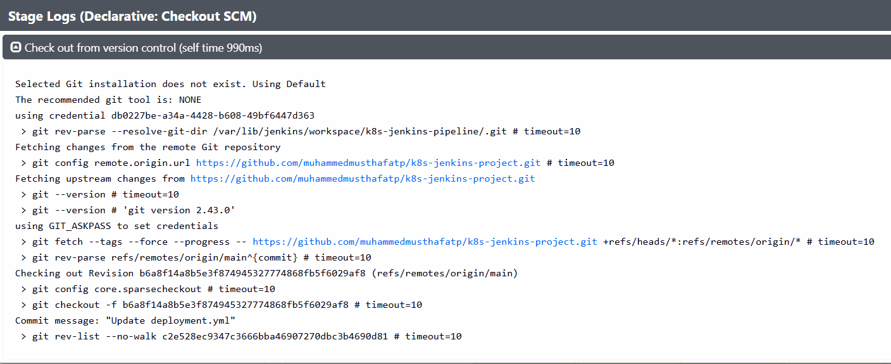</p>

### ✅ 2. Build Docker Image
<p align="center">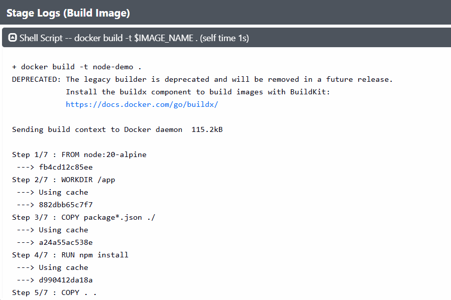</p>
<p align="center">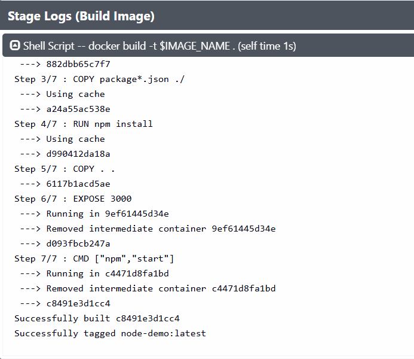</p>

### ✅ 3. Authenticate to Amazon ECR
<p align="center">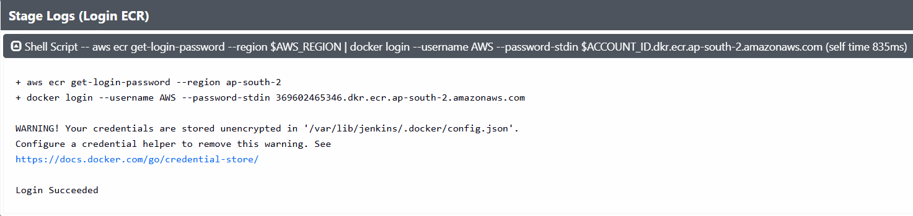</p>

### ✅ 4. Push Docker Image to ECR
<p align="center">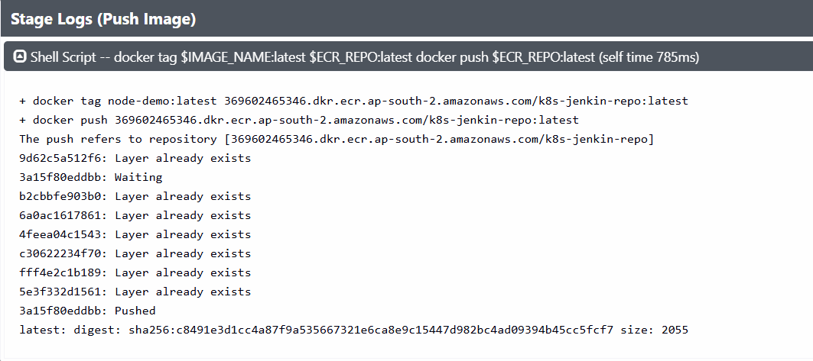</p>
<p align="center">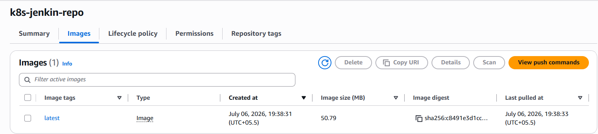</p>

### ✅ 5. Jenkins Pipeline — Full Stage View
<p align="center">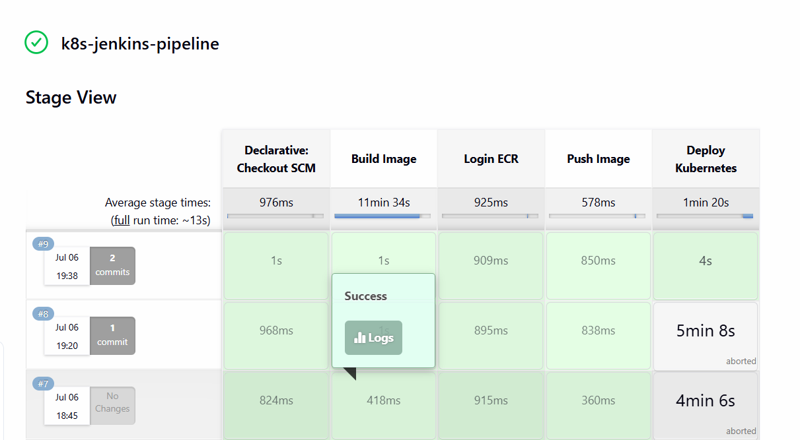</p>

### ✅ 6. Kubernetes Nodes
```bash
kubectl get nodes
```
<p align="center">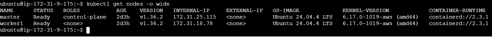</p>

### ✅ 7. Deploy to Kubernetes
<p align="center">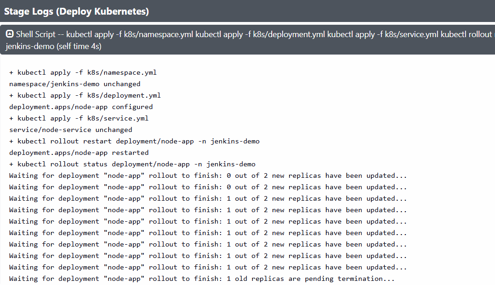</p>
<p align="center">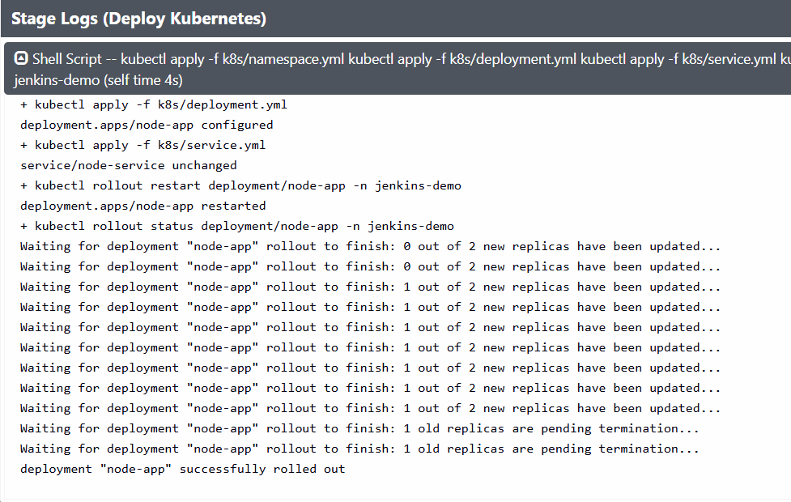</p>

### ✅ 8. Kubernetes Deployments
```bash
kubectl get deployments -n jenkins-demo
```
<p align="center">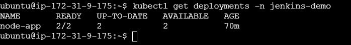</p>

### ✅ 9. Kubernetes Pods
```bash
kubectl get pods -n jenkins-demo
```
<p align="center">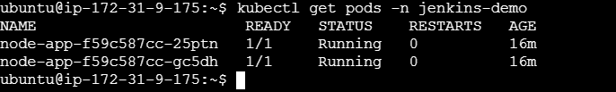</p>

### ✅ 10. Kubernetes Service
```bash
kubectl get svc -n jenkins-demo
```
<p align="center">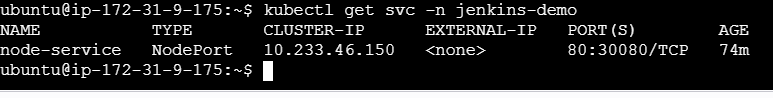</p>

### ✅ 11. Rolling Update Status
```bash
kubectl rollout status deployment/node-app -n jenkins-demo
```
<p align="center">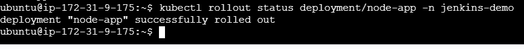</p>

### ✅ 12. Application Running Successfully
<p align="center">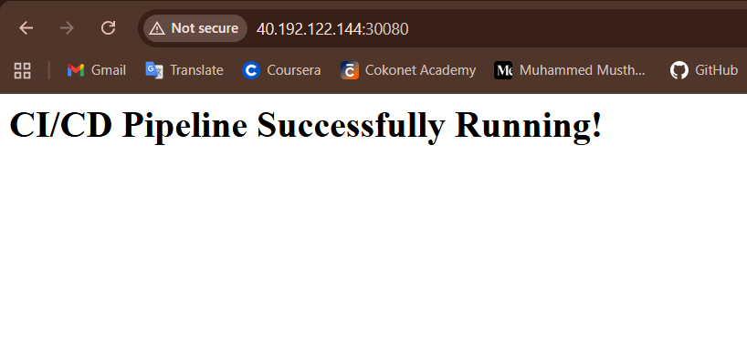</p>

---
## 🚧 Challenges Encountered

Real-world DevOps issues identified and resolved during implementation:

| Issue | Resolution |
|---|---|
| Docker build context error | Corrected Docker build path |
| AWS CLI credential error | Configured AWS CLI for the Jenkins user |
| Kubernetes authentication error | Copied kubeconfig into the Jenkins environment |
| `ImagePullBackOff` | Updated ECR image URI and configured `imagePullSecrets` |
| Kubernetes rollout stuck | Fixed image reference and validated deployment strategy |
| Secure registry authentication | AWS IAM & ECR login |
| Cluster provisioning at scale | Kubespray (Ansible-based) |

---

## 🎯 Skills Demonstrated

`CI/CD Pipeline Automation` `Jenkins Declarative Pipeline` `Docker Containerization` `Amazon ECR Integration` `Kubernetes Deployments` `Kubernetes Services` `Rolling Updates` `Git & GitHub` `AWS EC2 Administration` `Kubespray Cluster Deployment` `Linux System Administration` `Infrastructure as Code` `GitOps Fundamentals` `DevOps Troubleshooting`

---

## 📈 Future Enhancements

- [ ] GitHub Webhook Integration for automatic pipeline triggers
- [ ] Ingress Controller with NGINX
- [ ] TLS using Let's Encrypt
- [ ] Monitoring using Prometheus & Grafana
- [ ] Centralized Logging with the ELK Stack
- [ ] Helm Chart-based Deployments
- [ ] Argo CD for GitOps
- [ ] SonarQube Code Quality Analysis
- [ ] Trivy Container Image Scanning
- [ ] Blue-Green Deployments & Canary Releases
- [ ] Terraform for infrastructure provisioning

---

## 👨‍💻 Author

**Muhammed Musthafa T P**
Cloud • DevOps • Kubernetes • AWS

[](https://github.com/muhammedmusthafatp)
[](https://www.linkedin.com/in/muhammed-musthafa-tp/)

<div align="center">

</div>
